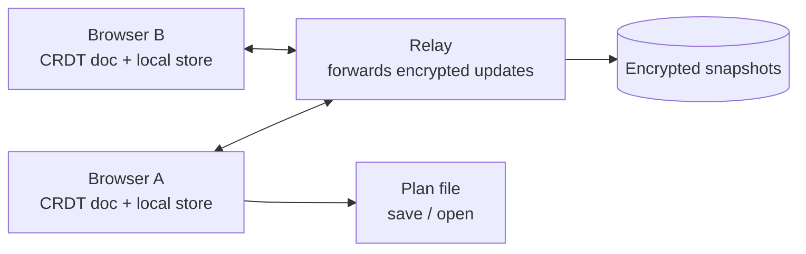

# Release Planning Whiteboard — Requirements (v0.3)

Provenance tags: _(recalled)_ = from memory, unverified; _(priors)_ = reasoned guess. Verify tagged claims before relying on them.

## Problem & goals

Multi-component enterprise releases fail at the seams. Dependencies between roadmap items, and several items landing on the same component at once, are invisible in the tools teams plan with. Jira holds the committed plan for execution, but it's a poor place to brainstorm, reshuffle, and argue about a plan before it's committed.

This tool is a collaborative planning whiteboard that sits upstream of Jira. Goals for v1:

- Let product leadership see how roadmap items relate: dependencies, shared components, and hierarchy.
- Let the same set of items be viewed from different perspectives (sequence, system area, size, time, team, customer) by pivoting axes, without re-entering data.
- Surface conflicts (dependency order violations, component contention, group mismatches) as highlights that prompt discussion, never as hard constraints.
- Let people build competing scenarios and compare them from any perspective, so trade-offs are legible.

**Positioning.** Existing tools cover pieces of this. Jira Plans offers scenarios and dependency views, but only over committed Jira data _(recalled)_. Miro and FigJam give the sticky-note feel, with no model of dependencies or components. This tool's bet is the combination: pivotable perspectives on one set of items, plus conflict highlights, before anything is committed. Check scope decisions against that bet.

## Users & usage context

The primary users are product leadership on a product line: product managers, engineering managers, and technical leads. They plan releases that span several components or several products in the same line.

New users usually arrive with no guide: from a public link or by word of mouth, and often with no data to import. The board has to explain itself to them, starting from a blank plan (Q53).

The tool serves two modes of work. In a live session, several people rearrange one plan together, like sticky notes on a whiteboard. In asynchronous back-and-forth, a PM proposes a scenario and an EM counters it days later. A plan moves through phases: brainstorming ideas and how they build on each other, then rough sizing, then placing work in time.

The project is open source. Users are likely to self-host inside their company network, because roadmaps are confidential.

## Core concepts

The model is a pivot table you manipulate by hand. Items carry properties. A view picks two properties as axes, and dragging a card into a cell writes those values.

**Item (card).** A unit of roadmap work with a title, a description, and property values. Items keep a stable ID across scenarios.

**Property (dimension).** A named attribute of an item. Some are built in and have special logic; the rest are custom. Values can form a hierarchy of any depth, such as area → service → subsystem or quarter → release. A property can hold several values, such as an item touching three components; that card appears once in each matching lane.

| Property | Kind | Special logic |
| --- | --- | --- |
| Sequence | Built-in, layout position | None on its own; dependency links carry all order |
| Dependencies | Built-in, item → item links | Drawn as lines; flagged when a prerequisite is placed after its dependent |
| System (e.g. Area → Service → Subsystem) | Built-in, user-defined levels, multi-valued | Contention detection at the deepest level |
| Size | Built-in, ordered (e.g. XS–XL) | Flagged when a child is larger than its group; no roll-up |
| Time → Release | Built-in, ordered, hierarchical | Checked against dependencies; contention measured here |
| Team, Customer, Theme, etc. | Custom select or tag, any depth | None; usable as axes and filters |

**View.** A choice of X and Y axes, each a property, with its hierarchy folded or unfolded to the depth wanted. Other properties show as attributes on the card. Every view has holding lanes along its right and bottom edges for cards with no value on one or both axes yet.

**Folding and expanding.** Seeing one level further down a hierarchy, without leaving the board: unfolding a property's band (area → service, quarter → release), or expanding a group in place to show its children (Q42, Q43). These replace zooming, which hid the rest of the board.

**Group.** Any item can contain other items, recursively, like grouping in a diagram editor. An item has at most one parent. A group keeps its own values, such as a PM's ballpark date or size, while its children refine them. Decomposing an item means turning it into a group and moving its dependencies to the specific children that have them.

**Scenario.** A fork of the plan that shares item IDs with its siblings. Scenarios can be compared item by item in any view. An item decomposed in one scenario but not the other shows as decomposed, with its new children listed.

## Functional requirements

**Board and views**

1. Users can pick any two properties as the X and Y axes of a view, and fold a hierarchical one to the level they want (requirement 7).
2. Dragging a card into a cell sets that card's values for both axis properties.
3. A card with several values on an axis appears in each matching lane. Dragging one copy replaces only that lane's value. Dropping with a modifier key adds a value instead. Dragging a copy to a holding lane removes only that copy's value on the lane's missing axis.
4. Cards show non-axis properties as compact attributes, such as a size badge in the sequence view.
5. Each view has holding lanes for cards missing a value, pinned to the board's edges. A lane at the end of each row holds cards with that row but no column, a lane under each column holds cards with that column but no row, and the corner holds cards with neither. Dropping a card in a holding lane sets the axis it names and clears the other. Holding lanes can show full cards or compact chips.
6. Sequence views show no step numbers or column labels, so placement doesn't read as a claim of order between unlinked items.
7. A hierarchical property is one axis choice. It shows its deepest level, with each parent as a band, and each band has its own holding lane for cards with only the parent value (Q34). Users can fold a band into one lane and unfold it again, one at a time or all at once (Q43).
8. Users can save named views and switch between them in one step.
9. Users can filter cards by any property, including custom tags.

**Items and groups**

10. Users can create, edit, and delete items directly on the board. Deleting a group deletes everything inside it, and one undo restores all of it (Q17). Items imported from Jira keep their Jira key (Q26).
11. Users can group items into a parent item, recursively, and ungroup them. They can move items into another group, or out to the top level (Q42).
12. Users can expand a group in place to see its children on the current board, each marked with its group, and fold it back (Q33, Q42). A group's own values show in the inspector (Q19, Q35).
13. Groups hold their own values, and a group's dependencies and component touches include its children's. The tool highlights a child dated outside its group, sized larger than its group, or in a different system area, and never overwrites either value. A collapsed group also shows as a faded frame in lanes that only its children touch, around the child cards that put it there; those children can be dragged (Q16, Q33). Groups can be expanded in place (Q33, Q42).
14. Grouping never creates a cycle, even when two people nest items at the same moment.

**Relationships and conflicts**

15. Users can draw dependency links between items, including between items at different group levels. Out-of-order links are always drawn; the others are drawn only for the hovered or selected card, upstream and downstream (Q14). A link is drawn by selecting the prerequisite, then the dependent, and pressing L (Q24). Pressing L again removes it. With one card selected, L starts a link that can be finished on any card, so cards at different group levels can be linked. A link to a card inside a collapsed group is drawn to the group (Q38). Loops are allowed and flagged (Q37). Cards can also be linked as "related", which implies no order and is never flagged (Q44). Hovering a card shows its other copies, and the links from all of them (Q45).
16. The tool highlights a dependency when the prerequisite is placed after its dependent: to its right in a sequence view, or in a later lane in a time view. A time view judges by the lanes it shows, so a folded quarter is one bucket and an unfolded one is a bucket per release (Q12, Q43).
17. The tool highlights a component when more items touch it in one time bucket than its concurrency limit allows. No limit applies until a user sets one, per component or as a plan default.
18. Conflicts inside a collapsed group are visible on the group card. The group's ⚠ count includes out-of-order links and loops inside it.
19. The tool never blocks a placement because of a conflict. Users can mark a specific conflict as reviewed, with a note; it stays suppressed until an involved item moves, meaning a change to an involved card's checked values, or a card joining or leaving the conflict (Q41).
20. A conflicts panel lists every active conflict by type, and users can hide any type.
21. Every feature works on items with no system values; conflict checks skip them. In a system view, dragging a card into a lane tags it, so the view doubles as the fastest way to fill in components.

**Scenarios**

22. Users can fork the current plan into a named scenario.
23. Users can compare two scenarios in any view. Moved cards show their old position and an arrow. Added, removed, changed, and decomposed items are marked.
24. The comparison lists conflicts present in one scenario but not the other.

**Properties**

25. Built-in properties are present in every plan and carry the logic above.
26. Users can add custom properties of type single-select or multi-select tag, with an optional hierarchy of any depth. They can be created by hand or from an imported column (Q25); sprint 2 builds flat ones first.
27. Users can edit the allowed values of hierarchical and ordered properties, such as the system taxonomy's levels and names, its components, or releases. Deleting a value moves its cards to the parent value, or to the holding lane when there's no parent (Q4).

**Import and export**

28. Users can import items from CSV with a column-mapping step, using Jira's CSV export as the reference format, including its Components field. An import replaces the board, undoably, and keeps each card's Jira key, so a later import can update the cards instead of duplicating them (Q26).
29. Users can save a plan to a file and open it again, including all scenarios.

**Sharing and collaboration**

30. Users can share a plan by link. The relay stores an encrypted snapshot, so recipients can open it later without the sender online.
31. Several users can edit the same plan at the same time and see each other's changes live. Nothing is locked: a card someone is dragging says so on everyone's board, and when two people move one card, the later drop wins and both are told, with a way back (Q60).
32. Users see who else is present, where they're pointing, what they've selected, and what they're dragging. Each is anchored to cards, so it shows on any view. Cursors can be shown for everyone, for the driver only, or for no one (Q61).
33. A shared plan has a "Can edit" link and a "Can view" link. Making new links cuts off the old ones, and people who had them keep what they already saw (Q62).
34. A browser keeps several plans, shared ones and ones only on that computer. On a shared plan, opening a file, importing and starting a blank plan each make a new plan. Replacing the shared plan for everyone is a separate, warned choice (Q58).
35. Editing offline is always allowed, and merges automatically on reconnecting. The board says what hasn't been shared yet. On coming back, users see what others changed while they were away, marked on the board, and which of their own changes didn't stick, each with a way to reapply or restore it (Q59).
36. Every change is recorded with who made it and when, kept indefinitely, and shown in each viewer's own time zone, in an activity feed for the plan and in a card's history (Q63).
37. Where a company can't use a hosted relay, collaboration still works in two ways (Q64):
    - one person runs the relay on their own computer, for colleagues on the same network: the same program a company would self-host;
    - a shared plan travels as an encrypted changes file, through channels the company already approves, such as email or a shared drive. Each person merges what others send.

    There's no peer-to-peer (WebRTC) fallback.

## Milestones

**M1: prove the core bet.** One person drives while others watch on a shared screen. Covers requirements 1–29: pivots and folding, groups, dependencies, contention, scenarios, custom properties, CSV import, and plan files. Built on the CRDT data model from day one, so M2 needs no rewrite _(priors)_.

**M2: collaboration.** Requirements 30–37, as sprint 9's research reshaped them (Q65, Q64):
- encrypted share links with stored snapshots, including view-only links;
- live multi-user editing;
- presence;
- several plans per browser;
- offline work, and seeing what changed while you were away;
- history;
- fallbacks where a hosted relay isn't allowed: a relay on one person's computer, and changes by file.

The relay is written in Go. The build plan is `docs/plans/m2-plan.md`, in five sprints.

**Later.** Merging between scenarios, typed dependencies, Jira sync, and undo history that survives a reload.

## Architecture & non-functional requirements

The plan is a document, not a database: a CRDT document held in each participant's browser. From M2 on, a thin relay syncs sessions and stores encrypted snapshots for share links.

- **Sync:** a CRDT library such as Yjs _(recalled: widely used for this, with a ready-made WebSocket relay)_.
- **Persistence:** in M1, autosave to browser storage plus explicit save and open of a plan file. In M2, shared plans also persist as encrypted snapshots, so a plan survives everyone leaving. The file format is documented and versioned.
- **Confidentiality:** sessions and snapshots are end-to-end encrypted, with the key in the URL fragment so the server never sees it _(recalled: Excalidraw's approach for shared links)_. The relay therefore can't read Yjs updates; it's a message broker and blob store.
- **Tree integrity:** grouping uses a move operation that can't create cycles under concurrent edits. Concurrent tree moves are a known CRDT problem with published solutions _(recalled)_, and naive implementations get it wrong.
- **Scale:** up to a few hundred items per plan, with a few dozen visible at once. Ordinary DOM or SVG rendering should be enough _(priors)_. Grouping and filtering keep views readable.
- **Self-hosting:** one container image serving the static app, the relay, and snapshot storage on local disk. The same relay runs on one person's computer for a pilot (Q64).
- **Accounts:** none. A display name and cursor color identify each participant.
- **License:** Apache 2.0.

## Out of scope for v1

- Live Jira integration, in either direction. CSV import covers the starting point.
- Merging or cherry-picking changes between scenarios. Stable item IDs keep this possible later.
- Server-readable storage, user accounts, SSO, and permissions.
- Auto-scheduling, or constraints that prevent conflicting placements.
- Capacity planning against team availability.
- Typed dependencies (finish-to-start, finish-to-finish, and so on). "Related to" links carry no order, so they're in scope (Q44).
- Summing relative sizes into totals.
- Soft "prefer before" links (possible future enhancement).
- Remembering card positions within a cell per view (hard to manage across screen sizes).

## Risks

- **Nobody tags components.** If items rarely get system values, contention detection stays empty and the headline feature never shows up. Mitigations: system views as a tagging tool (req. 21), and importing Jira's Components field (req. 28).
- **Conflict noise.** Dense data plus group mismatches could turn the board red. Mitigations: no default limit, a conflicts panel, per-type hiding, and reviewed conflicts.
- **Pivoting erases spatial memory.** Sticky-note boards work partly because things stay where people put them, and every pivot rearranges the board. Per-view positions are deferred; watch for this in user sessions.
- **Scope for a side project.** Even M1 is substantial. If it stalls, cut scenarios down to "compare two plan files" before cutting pivots or conflicts, since those are the core bet.

## Assumptions

- Groups hold their own values and children refine them. Mismatches are highlighted, never resolved automatically.
- Contention compares items in the same time bucket at the deepest system level, against a limit once one is set.
- Sequence is a layout position; dependency links carry all the ordering the tool checks.
- An item has at most one parent group.
- Custom properties are single-select or multi-select tags, with a hierarchy of any depth.
- Dependencies have one type: A must come before B.

Open questions live in `docs/questions.md`.
