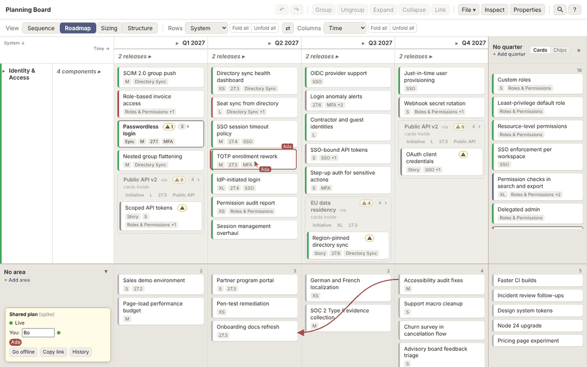
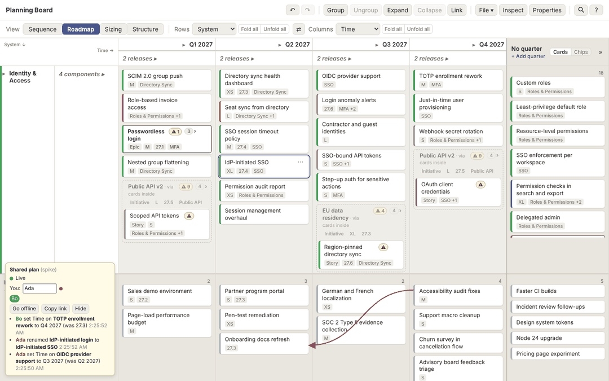
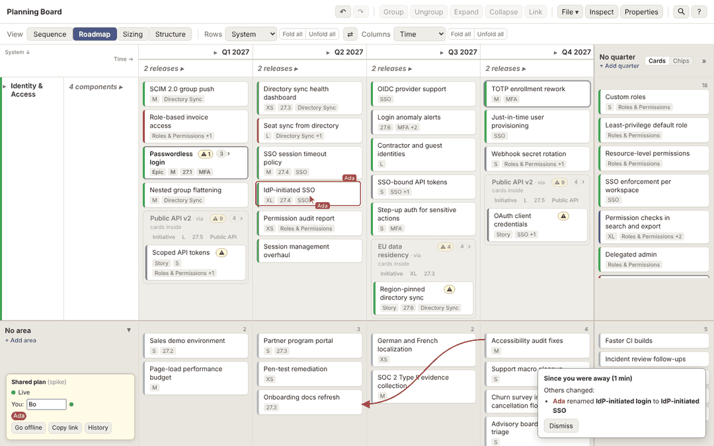

# Presence, and who changed what

Sprint 9, slice 4. What can people see of each other on a board where everyone may be in a different view? And what can an end-to-end encrypted board with no accounts record about who changed what, and at what cost? Both were built into the sync spike and tried on the real board (see `relay-and-sync.md` to run it).

## Presence is anchored to cards

Other tools broadcast a cursor as screen or canvas coordinates. That works when everyone looks at one canvas. Here it doesn't: Ada can be in Roadmap while Bo is in Sizing, with different bands folded and different groups expanded. Ada's "x = 640, y = 210" lands on an unrelated card on Bo's screen.

So the spike shares presence relative to cards. It sends:
- **Pointer:** the card under it, and where on that card, as fractions of its width and height. When it isn't over a card, nothing is shared.
- **Selection:** the IDs of the selected cards.
- **Drag:** the card being dragged, and the name of the cell or lane under the pointer ("Q3 2027, Identity & Access").
- **Name and color,** chosen per browser.

Each receiver draws it on their own board, wherever those cards are in their view:
- **Pointer:** a cursor and name tag, on the first copy of the card on screen.
- **Selection:** an outline in the person's color around every copy.
- **Drag:** a dashed outline, and "Ada is moving this → Q3 2027, Identity & Access".

*Bo's board in the spike. Ada's selection is outlined in her color, with her cursor on the card she's pointing at. The panel at the bottom left shows who's here and the connection state.*

**What it leaves open:**
- **A card that isn't on your board,** because it's inside a collapsed group or scrolled away, gets no cursor. The experience design (slice 5) decides whether its group's frame or an edge marker should show it.
- **Following someone means taking their view,** not their scroll position. The spike doesn't do it. It's designed in slice 5.
- **Presence is chatty.** About 200 bytes per message, at up to 20 a second per person while the pointer moves. That's nothing for a handful of people on an intranet. A session of 30 would want a slower rate, or cursors for the driver only (`prior-art.md`, §4).

**Why it matters for collisions.** `merge-scenarios.md` found that two people dragging one card is a coin toss at best (L1, L3) and a card in two areas at worst (L2). "Ada is moving this" on the card itself makes that collision unlikely, without locking anything. That's the cheapest fix for the live half of the PM's first priority. Whether it's enough is a question for the tester session.

## Who changed what: three ways, with their cost

From the second table in [`relay-measurements.md`](relay-measurements.md): the sample plan, the same 1,000 edits, and each way of recording who made them.

| Option | What it can answer | Size after 1,000 edits | Verdict |
|---|---|---|---|
| **None** (today) | Nothing | 60 KB | — |
| **1. Yjs's `PermanentUserData`:** maps each session's client ID to a name | "Which session inserted or deleted this piece of the document" | 60 KB | **No.** It's experimental, client IDs change every session, and it answers questions about Yjs's internals, not "who moved this card to Q3" (`prior-art.md`, §2). |
| **2. A history log of our own:** after each command, one entry with who, when, and each change in words | "Ada moved *Invoice redesign* to Q3 at 10:42" | 197 KB (+137 KB, about 160 bytes per change) | **Yes, if it's stored apart from the board** (below). The spike builds this. |
| **3. Yjs snapshots,** diffed later | "What changed between Tuesday and now", but not who | 70 KB, and it grows with every overwrite, since nothing deleted is ever discarded | **No.** Our own plan diff over periodic snapshots answers the same question without that growth. |

**The history log works, and has one problem: it grows faster than the board.** Logging into the board's own document tripled its size after 1,000 edits, and it never shrinks. Two changes fix that:
- **A history document of its own,** per plan: another encrypted Yjs document in the same relay room. The board stays lean, the history can be pruned (keep 90 days, say) without touching the board, and a plan file never includes it.
- **Compact entries:** IDs and values, turned into words when shown, not stored as text. That's about 60 bytes per change _(priors)_.

**What attribution can promise.** Names are self-chosen, and anyone holding the link can write any name, or any history entry. Times come from each person's clock. It's a courtesy among people who share a link, not an audit trail. The experience should never present it as one ("who did this, as far as the board knows").

*The spike's history in Ada's panel. Each line was recorded from a command's before and after, using the plan diff.*

## Since you were away

The prototype in the spike, on reconnecting or on opening a shared board after time away, lists:
- **What others changed,** from history entries made since you left: "Ada renamed *IdP-initiated login* to *IdP-initiated SSO*".
- **Your changes that didn't stick:** each change you made while offline that the merged board doesn't show. It's computed with the plan diff (`spikes/sync-client/diff.ts`): what you changed while away, against what the merged board shows for the same card and field. It catches the coin tosses (L3, L5, L7), the work lost to a deleted group (O4) and your overridden quarters (O1), the cases `merge-scenarios.md` said need showing.

*Bo, back online. Ada's rename made while he was away is listed. Both his offline move and her rename are on both boards.*

**What the prototype shows about the real design:**
- **A list in a corner is the weak form.** The board is spatial, and the strong form is on the board itself: the changed cards highlighted, a moved card with a ghost where it was and an arrow to where it is. That's exactly what scenario compare draws (requirement 23: "moved cards show their old position and an arrow"). One diff and one set of markers serve "since you were away", scenario compare and history. Slice 5 designs it, and the build plan should treat it as one feature.
- **"Your changes that didn't stick" needs a remedy beside each line.** "Use mine" reapplies the change, and "Restore" brings back a deleted group, which needs tombstones (`merge-scenarios.md`).
- **The plan diff is the shared piece.** It's a pure function over two plans, unit-testable in `src/domain/`, and it moves there when the build starts.

## Undo with several people

The spike and the merge harness agree. **Undo reverses only your own edits** (U1), because it tracks only edits made through commands on this device. History records an undo as "(undo)" with the changes it made, so other people can see what an undo did. With single values stored as one value (E1), undoing a move that someone has since overridden does nothing visible (E2). Slice 5 decides whether that deserves a word ("Bo has moved it since").

## Recommendations

1. **Make presence card-relative.** Share the pointer, selection and drag intent. Show drag intent on the card, as the main defense against live collisions.
2. **Keep history in its own encrypted document per plan,** with compact entries, pruned after a period the PM chooses. Don't use `PermanentUserData` or Yjs snapshots.
3. **Build one diff and one set of board markers** for "since you were away", scenario compare and history.
4. **Present attribution as a courtesy,** in wording and design. Accounts and signatures stay out of scope (requirements, "Out of scope for v1").
